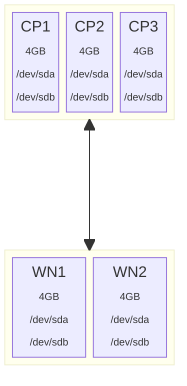

# Tofu-Talos-Cluster-Setup

## Background

This project details the pre-requisites and steps required to deploy a talos linux Kubernetes cluster on a Proxmox Virtual Environment.  It uses the open-source version of Terraform, a product called OpenTofu, to provision the VM's on the Proxmox server.  

The configuration of each VM is declared in a .tf file and tofu will generate an execution plan against the Proxmox environment that when applied will create the VMs with the exact specs listed in the tf file.  This approach ensures a level of consistency between different environments (assuming no changes are made to the TF files before executing the scripts).

### Assumptions

* You have a proxmox virtual server environment available with sufficient free resources available for the Talos Node VMs
* That you have experience with Proxmox VE and Talos Linux
* You're comfortable with or willing to learn about using the linux command line

Note: Each Talos Node that you configure will require at a minimum 4GB of RAM and two virtual storage drives (one for boot/system and another larger drive for a replicated ceph storage config)

## Pre-requisites

1. [Add a terraform linux user account](./docs/pre-requisites/add-linux-user-account.md)
2. [Environment Variables](./docs/pre-requisites//environment-variables.md)

## Preparing Tofu Resources

* make sure to set the environment variables for
  * Proxmox VE
  * Terraform (PM_USER/PASS, PM_API_TOKEN_ID, PM_API_TOKEN_SECRET, PROXMOX_VE_API_TOKEN, PM_API_URL, PM_TLS_INSECURE)


## Verifying the plan

## Applying the plan

## Retrieving the config files

Before you can do anything with either talos or kubernetes at the commandline you'll need to pull the configuration files from the provisioned cluster.  There are two configuration files that are needed.

1. The talosconfig file that provides configuration information on the provisioned talos cluster itself for the commandline utillity talosctl and 
2. The kubeconfig file that provides configuration information and user authentication for the kubernetes commandline utility kubectl

A convenience script has been created and made available in the `./scripts/` folder called `get-configs.sh` or `get-configs.ps1`

###  Getting the talos config file
Run the following command in a bash prompt to get the talosconfig file.

```bash
tofu output -raw talos_config > talosconfig
```

This should create a file in the current directory containing the talos cluster configuration and SSL cert information.

###  Getting the kube config file
Run the following command in a bash prompt


```bash
tofu output -raw kubeconfig > kubeconfig
```

This should create a file in the current directory containing the kube configuration and user identity information.
