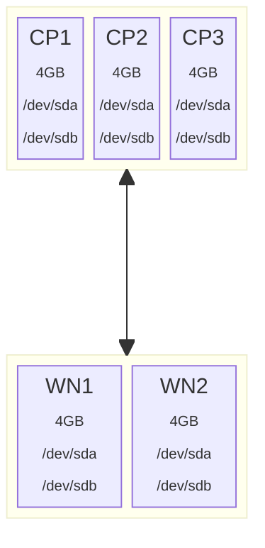

# Tofu-Talos-Cluster-Setup

## Background

This project details the pre-requisites and steps required to deploy a talos linux Kubernetes cluster on a Proxmox Virtual Environment.  It uses the open-source version of Terraform, a product called OpenTofu, to provision the VM's on the Proxmox server.  

The configuration of each VM is declared in a .tf file and tofu will generate an execution plan against the Proxmox environment that when applied will create the VMs with the exact specs listed in the tf file.  This approach ensures a level of consistency between different environments (assuming no changes are made to the TF files before executing the scripts).

### Assumptions

* You have a proxmox virtual server environment available with sufficient free resources available for the Talos Node VMs
* That you have experience with Proxmox VE and Talos Linux
* You're comfortable with or willing to learn about using the linux command line

Note: Each Talos Node that you configure will require at a minimum 4GB of RAM and two virtual storage drives (one for boot/system and another larger drive for a replicated ceph storage config)

## Pre-requisites

### Add a terraform linux user account on Proxmox

While using an account secured by an API Token is the most secure approach to working with the Proxmox API via Tofu, there are some operations (e.g. import a disk to a vm) that will only work via a ssh session.  For this reason, we need to setup a new linux user account on the Proxmox host called Terraform and configure it so that it has sudo access on the host.

#### Install sudo on proxmox
The sudo command isn't installed by default on proxmox so will need to be installed via an apt command;

```bash
apt update && apt install sudo -y
```

#### Create the terraform user
To create the new linux user account use the adduser command;

```bash
# adduser terraform
New password: <password>
Retype new password: <confirm password>
Changing the user information for test
Enter the new value, or press ENTER for the default
        Full Name []:
        Room Number []:
        Work Phone []:
        Home Phone []:
        Other []:
Is the information correct? [Y/n] 
#
```

#### Create a ssh key for the terraform user
Now we need to create ssh key pair for the terraform user.  

**Note:** This needs to be done from the machine on which the tofu scripts will be executed, not on the proxmox host.

To do this we need to use the ssh-keygen command;

```bash
# ssh-keygen -f terraform
Generating public/private ed25519 key pair.
Enter passphrase for "terraform" (empty for no passphrase): 
Enter same passphrase again: 
Your identification has been saved in terraform
Your public key has been saved in terraform.pub
....
# 
```

This should create two files (the first is the private key, the second is the public key).  Move both the `terraform` and `terraform.pub` files to the folder `~/.ssh`.

#### Copy the terraform ssh public key to the proxmox host
Now we need to send a copy of the public key for the terraform user to the Proxmox host so that proxmox can identify the ssh connection without requiring the password to be entered.

To do this we need to use the following command;

```bash
# ssh-copy-id 0i ~/.ssh/terraform terraform@<pve-host>
/usr/bin/ssh-copy-id: INFO: Source of key(s) to be installed: "/home/admin/.ssh/terraform.pub"
/usr/bin/ssh-copy-id: INFO: attempting to log in with the new key(s), to filter out any that are already installed
/usr/bin/ssh-copy-id: INFO: 1 key(s) remain to be installed -- if you are prompted now it is to install the new keys
terraform@<pve-host> password: 

Number of key(s) added: 1

Now try logging into the machine, with: 'ssh -i /home/admin/.ssh/terraform terraform@<pve-host>' and check to make sure that only the key(s) you wanted were added

# 
```

#### Add an alias to the .ssh/config file

Strictly speaking this step isn't required for tofu but it is useful if you need to manually check ssh access to the proxmox host.

Adding an alias to the ssh config file allows the terraform user to use a simpler format of the ssh command where they just specify the host alias defined in the config file and ssh will pickup the rest of the options from the config file itself.

Check the folder `~/.ssh` for a file called `config`.  If it exists already you can skip this next action.  If no file exists, then create one using the following commmand;

```bash
touch ~/.ssh/config
```

Now edit the file using a text editor;

```bash
nano ~/.ssh/config
```

Add the following to the config file and save then exit the editor'

```text
Host <Host Alias>
  User terraform
  Hostname <fully qualified domain name>
  IdentityFile ~/.ssh/terraform
```

Now we can test the alias by using the following command;

```bash
# ssh <Host Alias>
Linux pve-k8s 7.0.2-4-pve #1 SMP PREEMPT_DYNAMIC PMX 7.0.2-4 (2026-05-15T07:32Z) x86_64

The programs included with the Debian GNU/Linux system are free software;
the exact distribution terms for each program are described in the
individual files in /usr/share/doc/*/copyright.

Debian GNU/Linux comes with ABSOLUTELY NO WARRANTY, to the extent
permitted by applicable law.
Last login: Tue May 19 18:24:24 2026 from 192.168.10.241
terraform@<pve-host>:~$
```

## Preparing Tofu Resources

* make sure to set the environment variables for
  * Proxmox VE
  * Terraform (PM_USER/PASS, PM_API_TOKEN_ID, PM_API_TOKEN_SECRET, PROXMOX_VE_API_TOKEN, PM_API_URL, PM_TLS_INSECURE)


## Verifying the plan

## Applying the plan

## Retrieving the config files

###  Getting the talos config file
Run the following command in a bash prompt to get the talosconfig file.

```bash
tofu output -raw talos_config > talosconfig
```

This should create a file in the current directory containing the talos cluster configuration and SSL cert information.

###  Getting the kube config file
Run the following command in a bash prompt


```bash
tofu output -raw kubeconfig > kubeconfig
```

This should create a file in the current directory containing the kube configuration and user identity information.
