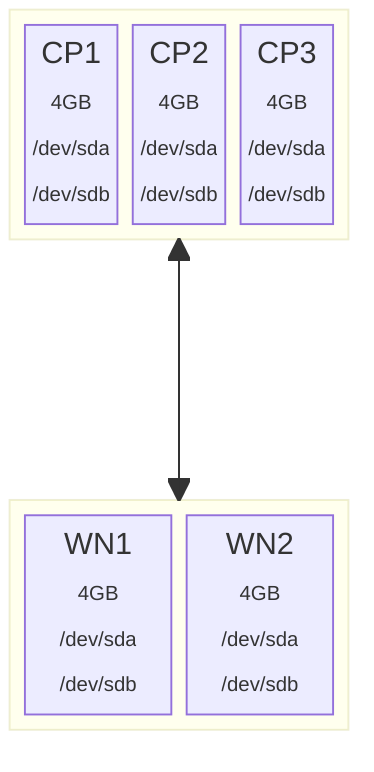

# Tofu-Talos-Cluster-Setup

## Background

This project details the pre-requisites and steps required to deploy a talos linux Kubernetes cluster on a Proxmox Virtual Environment.  It uses the open-source version of Terraform, a product called OpenTofu, to provision the VM's on the Proxmox server.  

The configuration of each VM is declared in a .tf file and tofu will generate an execution plan against the Proxmox environment that when applied will create the VMs with the exact specs listed in the tf file.  This approach ensures a level of consistency between different environments (assuming no changes are made to the TF files before executing the scripts).

### Assumptions

* You have a proxmox virtual server environment available with sufficient free resources available for the Talos Node VMs
* That you have experience with Proxmox VE and Talos Linux
* You're comfortable with or willing to learn about using the linux command line

Note: Each Talos Node that you configure will require at a minimum 4GB of RAM and two virtual storage drives (one for boot/system and another larger drive for a replicated ceph storage config)

## Pre-requisites

## Preparing Tofu Resources

## Verifying the plan

## Applying the plan
